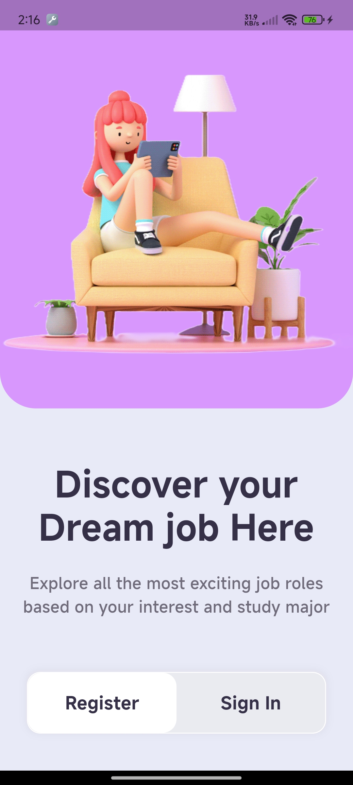
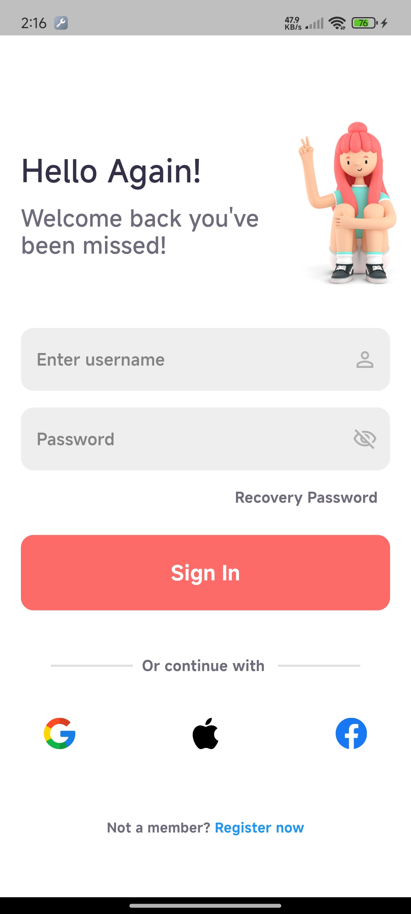
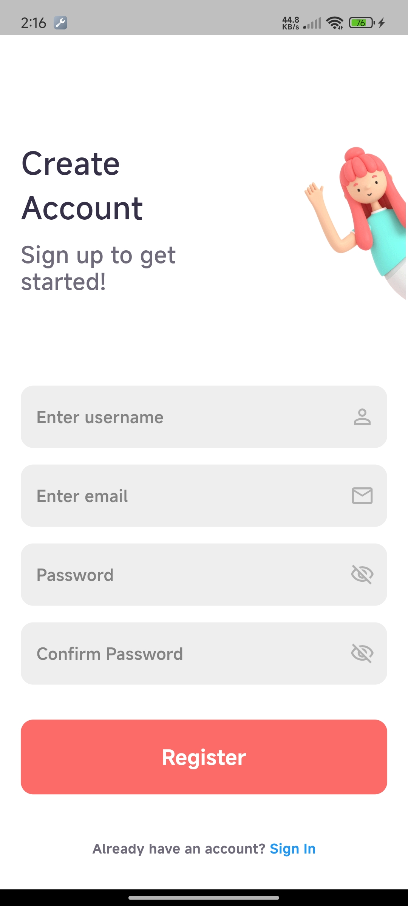

# Task

This project is a task provided by GDG (Google Developer Groups) to recruit me. The task involves creating a login and sign-up page using 'Material Design 3' or 'Material Design You' with Flutter. The application incorporates responsive UI elements and supports both light and ~~dark~~ modes.

## Task Requirements

- **Framework**: Flutter (highly recommended)
- **Design**: Material Design 3 or Material Design You
- **Features**:
  - Responsive UI elements
  - Light and ~~dark~~ modes
  - Basic form validation for user input (e.g., email format, password strength)

## Screenshots

| Welcome | Login | Sign Up |
|--------------|--------------|--------------|
|  |  |  |

## Getting Started

This project is a starting point for a Flutter application.

A few resources to get you started if this is your first Flutter project:

- [Lab: Write your first Flutter app](https://docs.flutter.dev/get-started/codelab)
- [Cookbook: Useful Flutter samples](https://docs.flutter.dev/cookbook)

For help getting started with Flutter development, view the
[online documentation](https://docs.flutter.dev/), which offers tutorials,
samples, guidance on mobile development, and a full API reference.

## Design Reference

You can create your own design or refer to the following links for design references:

- [Android Material UI Kit](https://material.io/design)

## Implementation Details

- **Login Page**: Includes fields for username and password with basic validation.
- **Sign-Up Page**: Includes fields for username, email, password, and confirm password with basic validation.
- **Light and ~~Dark~~ Modes**: The application supports light themes. ~~Dark mode~~ is not developed because the UI was looking worse in dark mode.

## Conclusion

This project demonstrates the use of Flutter to create a responsive and visually appealing login and sign-up page using Material Design principles. The application includes basic form validation providing a comprehensive solution for user authentication.